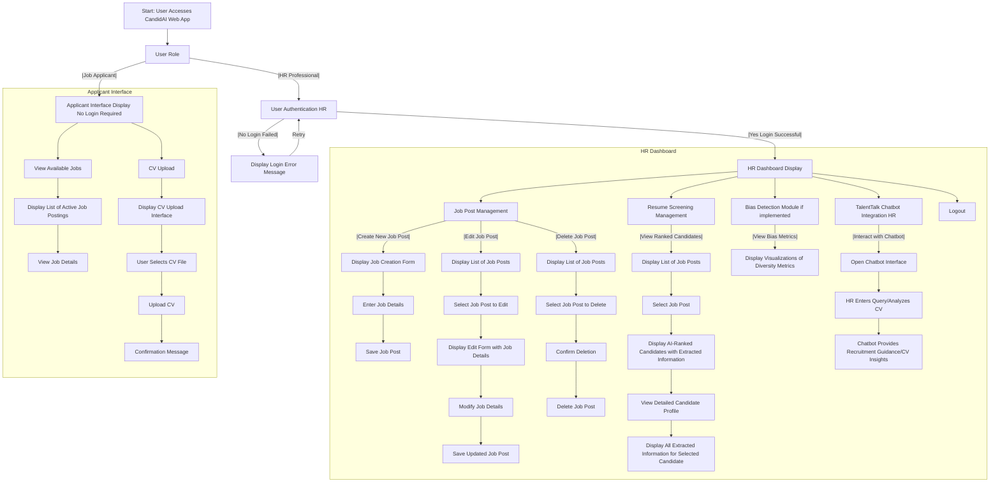

# Frontend
This repo contains the Frontend of the project

## UI flowchart

```mermaid
flowchart TD
    A[Start: User Accesses CandidAI Web App] --> B[User Role]
    B --|Job Applicant|--> E[Applicant Interface Display No Login Required]
    B --|HR Professional|--> C[User Authentication HR]
    C --|Yes Login Successful|--> D[HR Dashboard Display]
    C --|No Login Failed|--> CY[Display Login Error Message]
    CY -->|Retry| C

    subgraph HR Dashboard
        D --> D1[Job Post Management]
        D1 --|Create New Job Post|--> D1a[Display Job Creation Form]
        D1a --> D1b[Enter Job Details]
        D1b --> D1c[Save Job Post]
        
        D1 --|Edit Job Post|--> D1d[Display List of Job Posts]
        D1d --> D1e[Select Job Post to Edit]
        D1e --> D1f[Display Edit Form with Job Details]
        D1f --> D1g[Modify Job Details]
        D1g --> D1h[Save Updated Job Post]

        D1 --|Delete Job Post|--> D1i[Display List of Job Posts]
        D1i --> D1j[Select Job Post to Delete]
        D1j --> D1k[Confirm Deletion]
        D1k --> D1l[Delete Job Post]

        D --> D2[Resume Screening Management]
        D2 --|View Ranked Candidates|--> D2a[Display List of Job Posts]
        D2a --> D2b[Select Job Post]
        D2b --> D2c[Display AI-Ranked Candidates with Extracted Information]
        D2c --> D2d[View Detailed Candidate Profile]
        D2d --> D2e[Display All Extracted Information for Selected Candidate]

        D --> D3[Bias Detection Module if implemented]
        D3 --|View Bias Metrics|--> D3a[Display Visualizations of Diversity Metrics]

        D --> D4[TalentTalk Chatbot Integration HR]
        D4 --|Interact with Chatbot|--> D4a[Open Chatbot Interface]
        D4a --> D4b[HR Enters Query/Analyzes CV]
        D4b --> D4c[Chatbot Provides Recruitment Guidance/CV Insights]

        D --> DX[Logout]
    end

    subgraph Applicant Interface 
        E --> E1[View Available Jobs]
        E1 --> E1a[Display List of Active Job Postings]
        E1a --> E1b[View Job Details]

        E --> E2[CV Upload]
        E2 --> E2a[Display CV Upload Interface]
        E2a --> E2b[User Selects CV File]
        E2b --> E2c[Upload CV]
        E2c --> E2d[Confirmation Message]

        
    end
```
